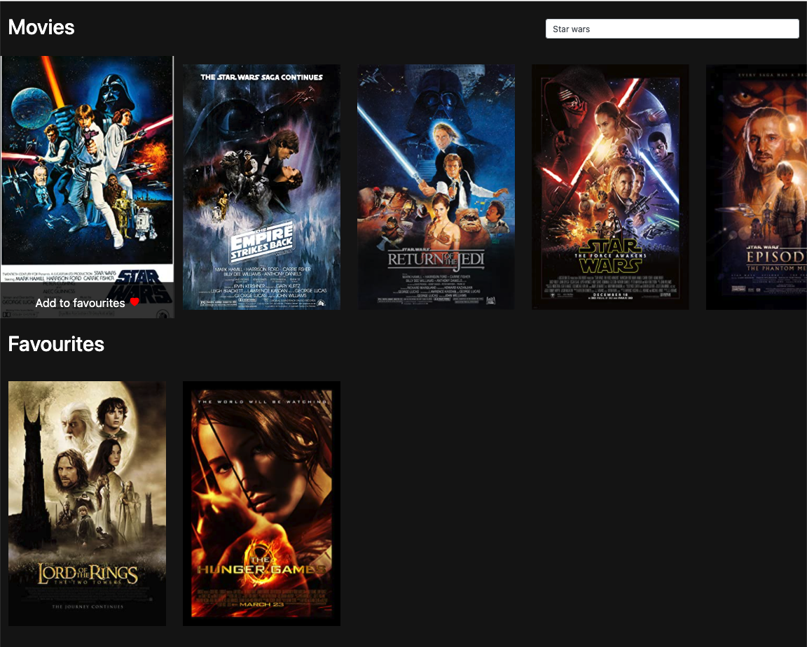

# Movie App

A movie app, created using React.

Users can search for and retrieve movies from the Open Movie Database, using the API. The app displays images for each movie. The user can save the movies to favourites, which are retained in local storage and can also remove movies from favourites.

## Screenshot

## Concepts

The app incorporates the following features:

- React functional components
- React Hooks
- Bootstrap
## Status

Project is: COMPLETE
## Inspiration

Project created using [Chris Blakely's YouTube tutorial](https://www.youtube.com/watch?v=jc9_Bqzy2YQ)

An extra thank you to [Rita Łyczywek](https://www.flynerd.pl/) for this excellent README template
## Contact

Created by [@jlopenshaw](https://twitter.com/Jlopenshaw) - feel free to contact me about the project
